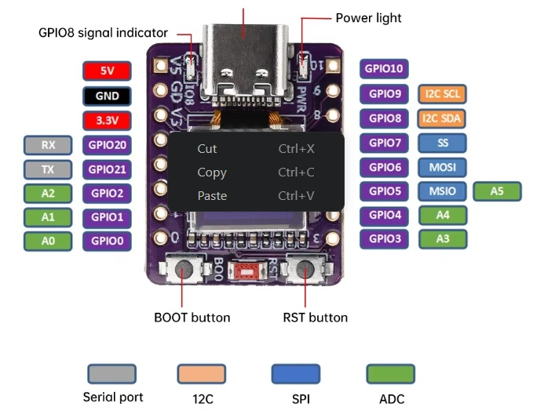

# ESP32-C3 Force Sensor

Wireless force measurement system with WiFi connectivity, web interface, and real-time OLED display.

## Features

- **HX711 Force Sensor** integration with calibration and taring
- **0.42" OLED Display** for real-time feedback
- **WiFi Connectivity** with fallback to Access Point mode
- **Web Server** with JSON API
- **Non-blocking Display Queue** for smooth operation
- **Configurable WiFi Networks** (3 fallback options)
- **LittleFS** for configuration storage

## Hardware

### ESP32-C3 Development Board

- Processor: ESP32-C3 (RISC-V, single-core)
- RAM: 400 KB
- Flash: 4 MB
- Interfaces: GPIO, I2C, SPI, UART



### HX711 Force Sensor Wiring

Pin configuration in [src/HwInterface.h](src/HwInterface.h):

- ESP32-C3 GPIO4 → HX711 DT (Data)
- ESP32-C3 GPIO9 → HX711 SCK (Clock)
- ESP32-C3 GND → HX711 GND
- ESP32-C3 3.3V → HX711 VCC

**Notes:**
- Use a stable 3.3V power supply for the HX711
- Keep wires short to minimize noise
- Use shielded cables if possible
- Load cell must be properly connected to the HX711 amplifier
- Calibration is required before first use

### 0.42" OLED Display Wiring

I2C interface configuration (hardwired — **NOT changeable**):

- ESP32-C3 GPIO5 → OLED SDA (fix verlötet)
- ESP32-C3 GPIO6 → OLED SCL (fix verlötet)
- ESP32-C3 GND → OLED GND
- ESP32-C3 3.3V → OLED VCC

**Specifications:**
- Display: SSD1306 (0.42" OLED, 72×40 pixels)
- I2C Address: 0x3C
- I2C Speed: 400 kHz (configurable)

**Notes:**
- OLED pins are **permanently soldered** (fix verlötet) — do NOT attempt to change GPIO5/GPIO6 without resoldering
- U8G2 library is used for display control
- Display updates throttled to max 10/sec to prevent I2C blocking

### Buttons

- GPIO1: Tare Button (measure zero point)
- GPIO2: Calibrate Button (calibrate against known weight)

**Notes:**
- Buttons are active-LOW with internal pull-ups
- Press and hold for 1 second to trigger action
- Button must be released after 1 second for action to fire
- GPIO0 NOT used (reserved for boot mode detection)

### LED

- GPIO8: Onboard LED (HTTP activity indicator)

## Software Architecture

### Main Components

1. **Global State** (`src/Global.cpp`)
   - Assembly object holds device state
   - Force value, WiFi status, configuration
   - Persists settings to LittleFS

2. **WiFi Management** (`src/WifiService.cpp`)
   - Event-based WiFi handling
   - Automatic reconnection
   - Configurable networks with fallback

3. **Web Server** (`src/app_webserver.cpp`)
   - HTTP endpoints for data and control
   - JSON API responses
   - File serving from LittleFS

4. **Display System** (`src/display.cpp`)
   - Queue-based rendering
   - Non-blocking OLED updates (max 10/sec)
   - Support for timed messages

5. **Force Sensor** (`src/Force.cpp`)
   - HX711 driver integration
   - Calibration and taring
   - Rolling history buffer (50 samples, 200ms interval)

## Web API Endpoints

### Data Endpoints

- `GET /` - HTML interface (index.html)
- `GET /json` - Digital pin states (test endpoint)
- `GET /assembly` - Complete device state (JSON)
- `GET /getkeys` - Button states (JSON)

### Control Endpoints

- `GET /reboot?bootmode=espreboot` - Reboot device
- `GET /dir` - List files on LittleFS
- `POST /upload` - Upload files to LittleFS
- `POST /store` - Store raw content to file

### Response Format

```json
{
  "hostname": "ESP32-C3",
  "deviceId": "force_sensor_001",
  "wifiConnected": true,
  "localIp": "192.168.1.100",
  "ssid": "MyNetwork",
  "state": 1,
  "stateText": "Measure",
  "force": 9.81,
  "offset": 0,
  "scale": 100.0,
  "forceHistory": [0.0, 0.1, 0.2, ...],
  "rssi": -65
}
```

## Configuration

### WiFi Networks

Edit [src/credentials.h](src/credentials.h):

```cpp
#define WIFI_SSID_1     "MyNetwork1"
#define WIFI_PASSWORD_1 "password1"

#define WIFI_SSID_2     "MyNetwork2"
#define WIFI_PASSWORD_2 "password2"

#define WIFI_SSID_3     "MyNetwork3"
#define WIFI_PASSWORD_3 "password3"
```

**WiFi Fallback Behavior:**
1. Firmware attempts each configured network for 15 seconds
2. Cycles through all 3 networks twice (2 complete rounds)
3. If all attempts fail, automatically activates **Access Point mode**
4. OLED display shows WiFi search progress: `(index)/(round)/(max_rounds)`
5. Total timeout: ~90 seconds (3 networks × 15 sec × 2 rounds) before AP mode

### HX711 Calibration

1. Press Key 0 (GPIO0) to enter Tare mode
2. Remove all load and wait 1 second
3. Device measures zero point
4. Place known weight on load cell
5. Press Key 1 (GPIO2) to enter Calibrate mode
6. Device calculates scale factor
7. Configuration is saved to LittleFS

### Device Configuration

Stored in `/config_main.json`:

```json
{
  "DEVICEID": "force_sensor_001",
  "SCALE": 100.0,
  "OFFSET": 0,
  "TARA_CALIBRATE_KG": 1.0
}
```

**Notes:**
- Access Point mode is **always enabled** as fallback when all configured WiFi networks fail to connect
- No configuration option needed — automatic behavior

WiFi networks in `/config_wlan.json`:

```json
[
  {"SSID": "Network1", "PASSWORD": "password1"},
  {"SSID": "Network2", "PASSWORD": "password2"},
  {"SSID": "Network3", "PASSWORD": "password3"}
]
```

## Building and Uploading

### PlatformIO

```bash
# Build for ESP32-C3
pio run -e esp32-c3-oled

# Upload to device
pio run -e esp32-c3-oled -t upload

# Monitor serial output
pio run -e esp32-c3-oled -t monitor
```

### VS Code

Use the PlatformIO sidebar (bottom left corner) for build, upload, and monitoring.

## Debug Output

Serial monitor shows:

- WiFi connection status with IP and signal strength
- HTTP request logging
- HX711 sensor readings
- Force calculation and history
- Device state changes
- OLED display updates (throttled to 10 updates/sec)

Example:

```
[WIFI] ===== CONNECTED =====
[WIFI] SSID: MyNetwork
[WIFI] IP Address: 192.168.1.100
[WIFI] Signal Strength: -65 dBm
[HTTP] GET /assembly
[DISPLAY] Enqueued item. Queue size: 1
```

## Pin Configuration Summary

| GPIO | Function | Purpose |
|------|----------|---------|
| 1 | Input | Tare Button |
| 2 | Input | Calibrate Button |
| 4 | SPI | HX711 DT (Data) |
| 5 | I2C | OLED SDA |
| 6 | I2C | OLED SCL |
| 8 | Output | LED (HTTP Activity) |
| 9 | SPI | HX711 SCK (Clock) |

## Known Limitations

- Single-core processor (concurrent operations are time-sliced)
- 400 KB RAM (limited buffer sizes)
- OLED I2C speed limits display update frequency to ~10/sec
- No support for concurrent HTTPS (only HTTP)
- Force sensor history limited to 50 samples (10 seconds at 200ms interval)

## Troubleshooting

### OLED Not Showing Content

- Check GPIO 5 (SDA) and GPIO 6 (SCL) are properly connected
- Verify I2C pull-up resistors are present (usually built-in on OLED module)
- Check OLED address (default: 0x3C)

### HX711 Not Reading

- Verify GPIO 4 (DT) and GPIO 9 (SCK) connections
- Check HX711 power supply (needs stable 3.3V)
- Verify load cell is properly connected to amplifier
- Run calibration after any hardware changes

### WiFi Not Connecting

- Check credentials in `src/credentials.h`
- Verify network is in 2.4 GHz mode (not 5 GHz)
- Device will automatically activate **Access Point mode** after ~90 seconds if WiFi fails
- Watch serial output for: `[WIFI] Access Point created: force_sensor_XXX`
- Connect to AP SSID: `force_sensor_[deviceId]` (no password required)
- Access web interface at `192.168.4.1`

### Web Server Not Responding

- Check WiFi is connected (see serial output)
- Verify correct IP address
- Ensure LittleFS filesystem is mounted (index.html is present)

## Architecture Notes

### Display Queue System

The OLED display uses a non-blocking queue to prevent the slow I2C communication from blocking the main loop:

1. Display updates are enqueued (max 10 items)
2. `displayUpdate()` is called every loop cycle
3. Updates are throttled to max 10/sec to maintain responsive buttons/sensors
4. Each item shows for configurable duration (e.g., 500ms for HTTP logs, 2s for WiFi info)

This keeps the force sensor and buttons responsive even while updating the display.

### WiFi Event-Based Architecture

WiFi management is purely event-driven:

- No polling or blocking WiFi operations
- Events: `ARDUINO_EVENT_WIFI_STA_GOT_IP`, `ARDUINO_EVENT_WIFI_STA_DISCONNECTED`
- Event handlers update `Assembly.wifiConnected` state
- Main loop checks state but doesn't manage connectivity

**Access Point Fallback:**
- Implemented in `wifiLoop()` with MAX_WIFI_ROUNDS = 2 (hardcoded fallback strategy)
- No configuration option needed — automatically activates after 2 rounds through all networks
- SSID format: `force_sensor_[deviceId]` (no password required)

## Development

- **Language:** C++17
- **Framework:** Arduino (esp32 core)
- **Libraries:** U8G2, ArduinoJson, HX711
- **Build System:** PlatformIO
